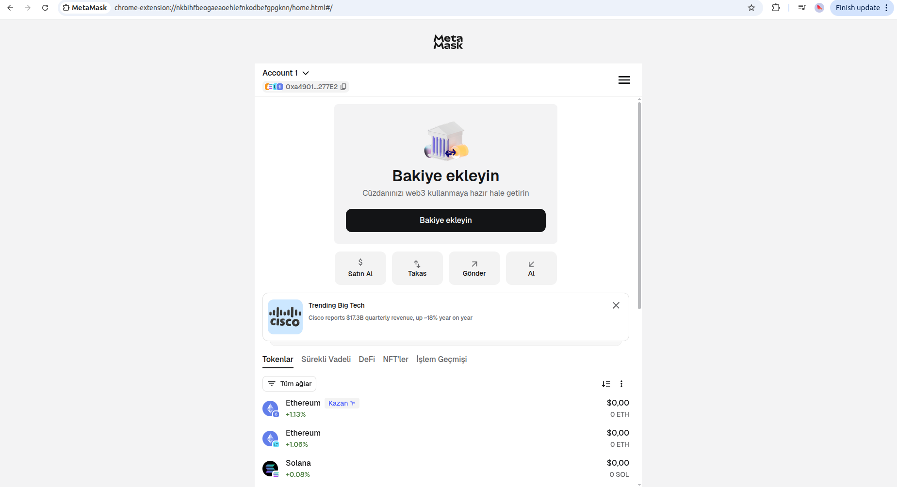
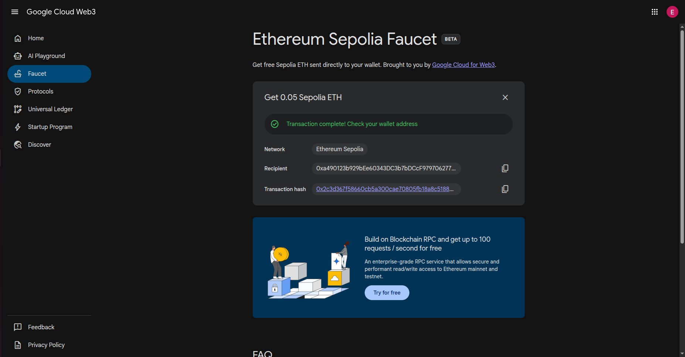
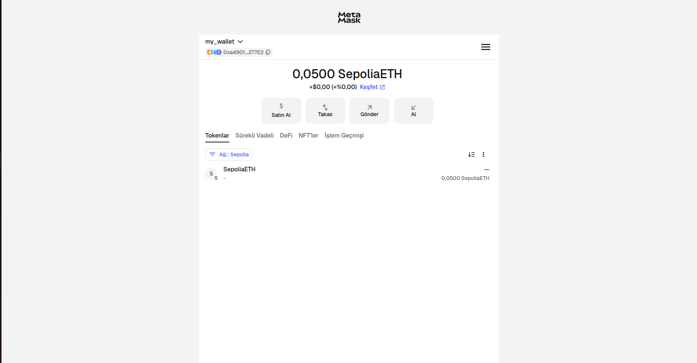
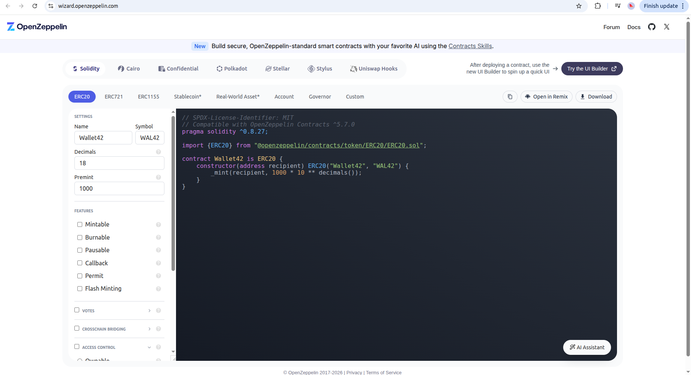
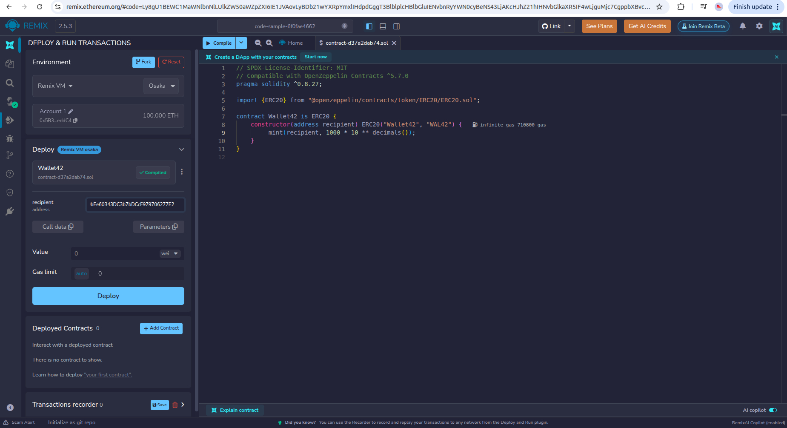
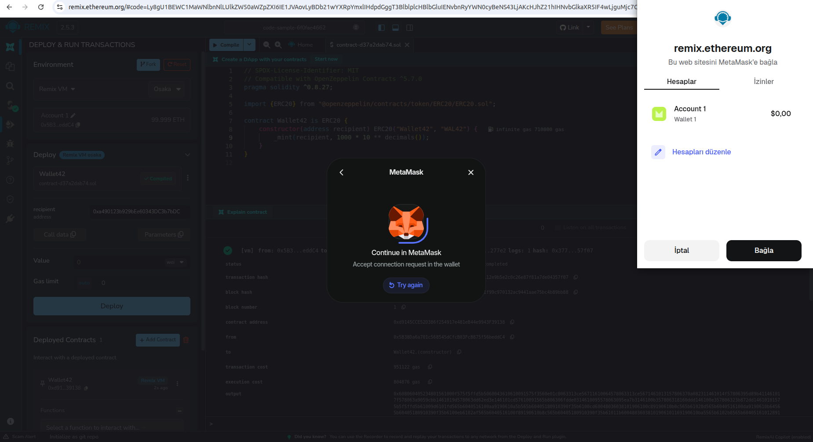
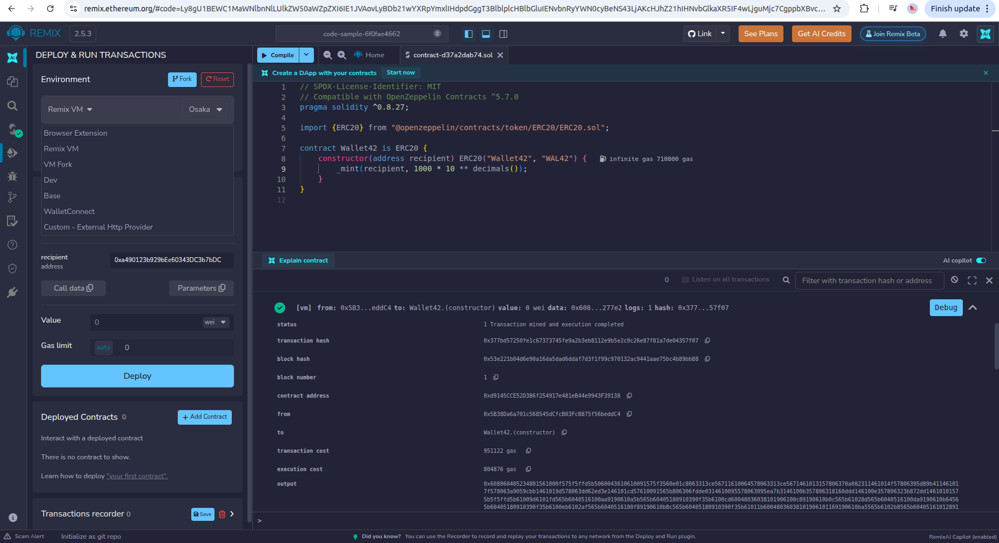
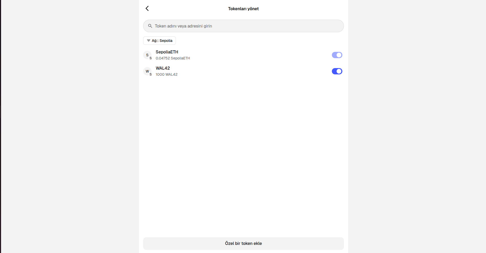
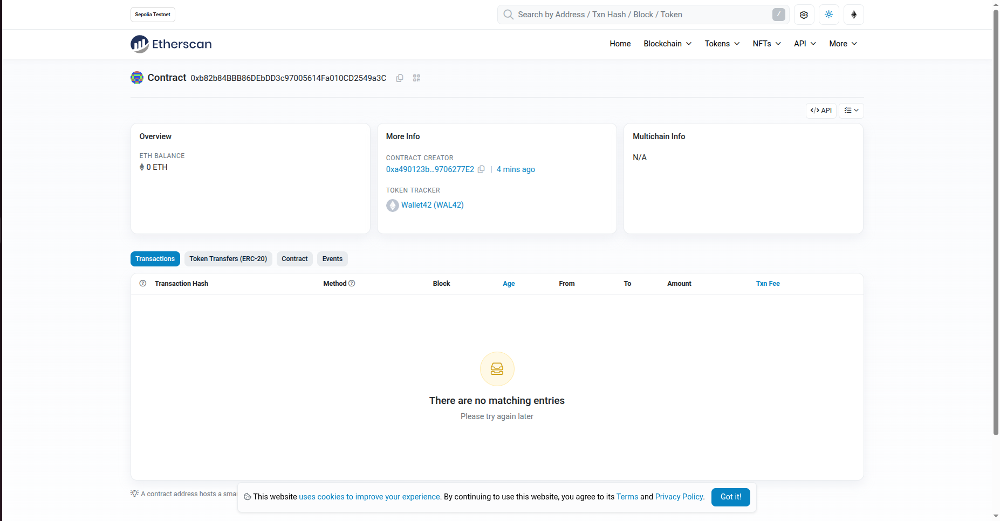

## Deployment Tools

- ### Wallet: [Metamask](https://metamask.io/)

First create your wallet on Metamask.

<u>Metamask:</u> is an Ethereum wallet that allows you to store ETH, as well as any token running on the Ethereum blockchain.

It's also Ethereum browser that allows you to interact with decentralized Ethereum applications (dApps) right from your web browser.

So after creation of wallet we will connect/link to the other platforms.

  

- ### Faucet: [Google Faucet](https://cloud.google.com/application/web3/faucet)

To get your initial free (gas) tokens use Google Cloud faucet.

A faucet is an application that dispenses free tokens on a testnet (a blockchain network used for development and testing). These tokens allow you to experiment with the testnet, such as deploying smart contracts or debugging transactions.

<u>Google Cloud faucet</u>: provides web3 developers with free tokens for deploying, testing, and optimizing smart contracts on popular testnets like Holesky and Sepolia.

<table align="center">
<tr>

<td width="50%" align="center" style="vertical-align:middle; ">

</td>

<td width="50%" align="center" style="text-align:center;">

</td>

</tr>
</table>

- ### Implementation / Security: [OpenZeppelin](https://wizard.openzeppelin.com/)

Instead of writing our smart contract from scratch i prefer to use OpenZeppelin contracts. It's already tested and robust.

<u>OpenZeppelin:</u> is an open-source framework designed to build secure smart contracts on blockchain platforms like Ethereum. At its core, OpenZeppelin provides a comprehensive library of reusable, tested, and audited smart contract components. These components are essential for developers who aim to create secure, efficient, and reliable decentralized applications (dApps).

  

- ### Development and Deployment: [Remix](https://remix.live/)

After writing your smart contract you can click the "Open in Remix" tab and it will directly open your contract on Remix.

<u>Remix:</u> is the open-source Web3 IDE to build, test, and deploy smart contracts in your browser.

Open your smart contract on Remix and connect your wallet.

<table align="center">
<tr>

<td width="50%" align="center" style="vertical-align:middle; ">

</td>

<td width="50%" align="center" style="text-align:center;">

</td>

</tr>
</table>

Deploy your token and upload it your wallet.

<table align="center">
<tr>

<td width="50%" align="center" style="vertical-align:middle; ">

</td>

<td width="50%" align="center" style="text-align:center;">

</td>

</tr>
</table>

- ### Network: [Sepolia Testnet](https://etherscan.io/)

Now you can see your logs on Etherscan.

My contract adress is 0xa490123b929bEe60343DC3b7bDCcF979706277E2.

  

For details explained in [document file](../documentation/readme.md).