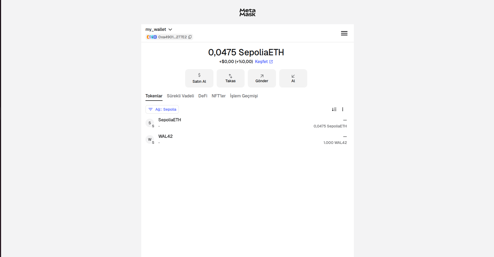
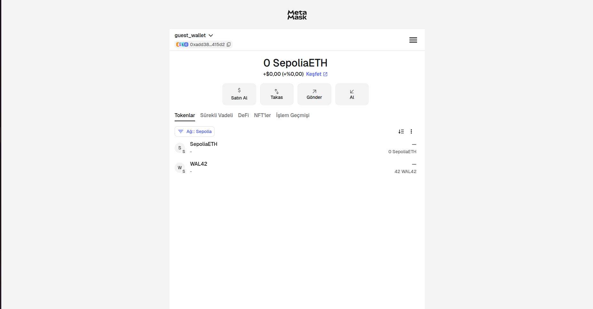
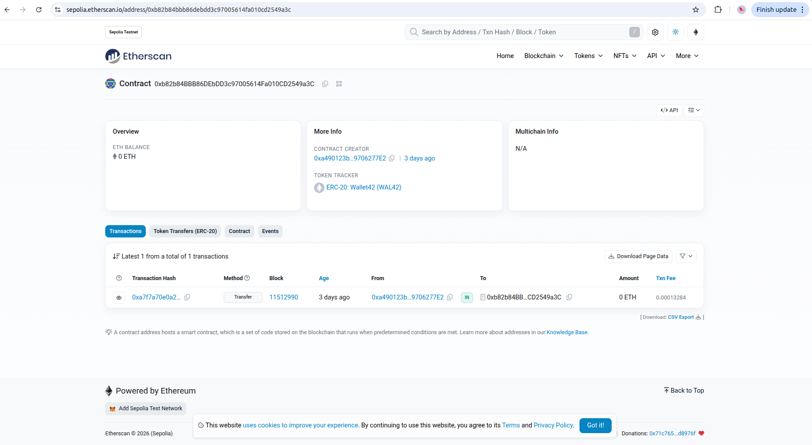
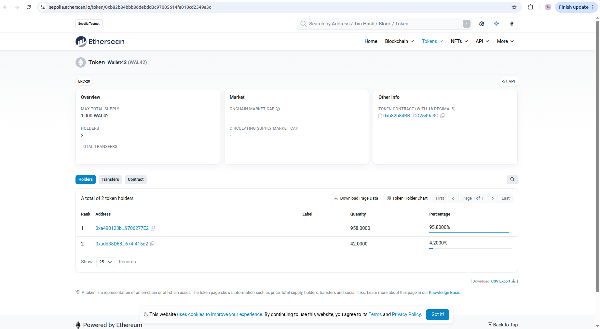

### Operations

In this section there will be explanation of how token works with one example.

In the begining we have one wallet as a "my_wallet". This wallet is core wallet and have all (1000) WAL42 tokens.

  

Create a another wallet to perfom transfering operations. This new wallet as guest_wallet has 0 token at the begining.

  

Now send a 42 token from my_wallet to guest_wallet. Now my_wallet has 958 WAL42 token and guest_wallet has 42 WAL42 token.

<table align="center">
<tr>

<td width="50%" align="center" style="vertical-align:middle; ">

</td>

<td width="50%" align="center" style="text-align:center;">

</td>

</tr>
</table>

Check your operations from Etherscan.

<table align="center">
<tr>

<td width="50%" align="center" style="vertical-align:middle; ">

</td>

<td width="50%" align="center" style="text-align:center;">

</td>

</tr>
</table>