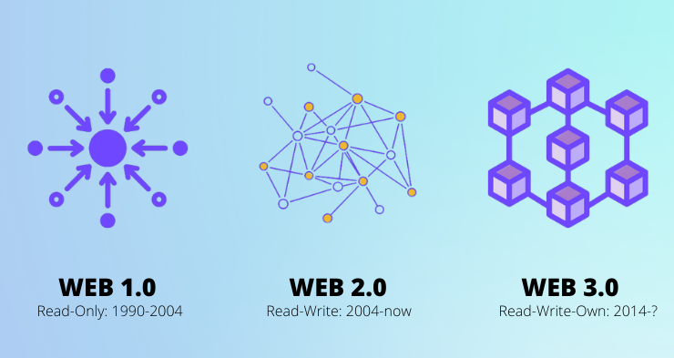
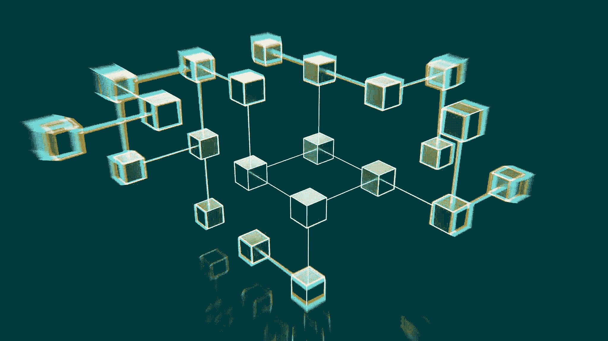
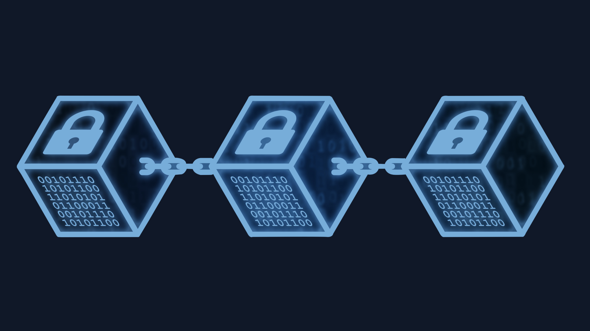
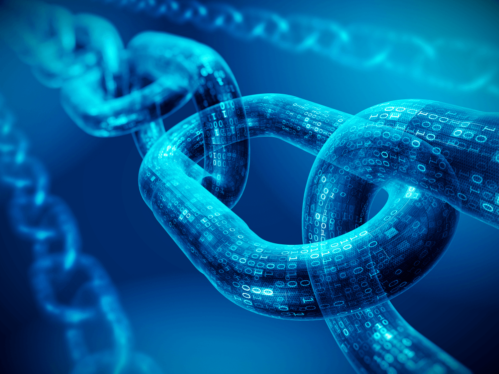
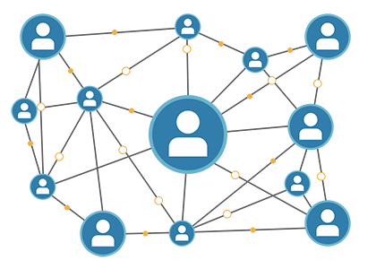
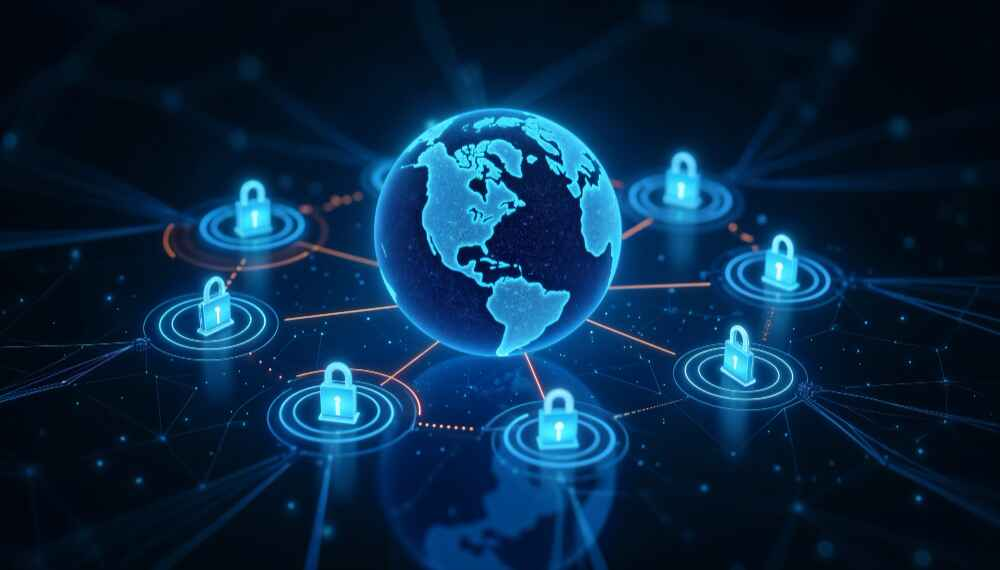

# Tokenizer

In this project we will build our own token. Cyrpto token represents an asset or stake and its built on an existing blokchain. Before to get into the details about what is token or how we created it, we need to understand some related concepts. In this readme file there will be explanation of these concepts to make easier to understand of what is token and how we created..

## History of Web

As Johnny Ryan [mentioned](https://press.uchicago.edu/ucp/books/book/distributed/H/bo10546731.html) internet firstly created for USA army to comminucate with each other from single center. This "internet" works as a infrastructure. After a years web is created. Web is working on internet as a system.

From the day web was invented to today its evolved by human needs. It's published as web1. Today we have web1, web2 and web3.

### Web1: Read-Only

The first inception of Berners-Lee's creation, now known as 'Web 1.0', occurred roughly between 1990 to 2004. Web 1.0 was mainly static websites owned by companies, and there was close to zero interaction between users - individuals seldom produced content - leading to it being known as the read-only web.

### Web 2.0: Read-Write

The Web 2.0 period began in 2004 with the emergence of social media platforms. Instead of a read-only, the web evolved to be read-write. Instead of companies providing content to users, they also began to provide platforms to share user-generated content and engage in user-to-user interactions.

As more people came online, a handful of top companies began to control a disproportionate amount of the traffic and value generated on the web. Web 2.0 also birthed the advertising-driven revenue model. While users could create content, they didn't own it or benefit from its monetization.

	

### Web 3.0: Read-Write-Own

The premise of 'Web 3.0' was coined by Ethereum co-founder Gavin Wood shortly after Ethereum launched in 2014. Gavin put into words a solution for a problem that many early crypto adopters felt: the Web required too much trust. That is, most of the Web that people know and use today relies on trusting a handful of private companies to act in the public's best interests.

Web3 has become a catch-all term for the vision of a new, better internet. At its core, Web3 uses blockchains, cryptocurrencies, and NFTs to give power back to the users in the form of ownership.

## Blockchain ?

<table align="center">
<tr>

<td width=50%" align="center" style="vertical-align:middle; padding-right:20px; text-align:center;">
Blockchain is a revolutionary technology that functions as a shared, immutable digital ledger. The name "blockchain" comes from its structure data is organized in blocks, with each new block linked to the one before it, forming a continuous chain.

</td>

<td width="100%" align="center" style="text-align:center;">

</td>

</tr>

<tr>

<td width="50%" align="center" style="text-align:center;">

</td>

<td width=50%" align="center" style="vertical-align:middle; padding-right:20px; text-align:center;">
Each block contains crucial data, such as a list of transactions, a timestamp, and a unique identifier called a cryptographic hash. This hash is generated from the block's contents and the hash of the previous block, ensuring that each block is tightly connected to the one before it.
</td>

</tr>

<tr>

<td width=50%" align="center" style="padding-right:20px text-align:center;">

- Blockchain's linked structure makes data tampering detectable by altering hashes and breaking the chain.
- It acts as a distributed database, storing transactions across the network.
- Each transaction is verified by the majority, ensuring legitimacy.
- This decentralization prevents any single party from manipulating the data.
</td>

<td width="45%" align="center">
  

</td>

</tr>

<tr>

<td width="40%" align="center">
  

</td>

<td width=100%" align="center" style="vertical-align:middle; padding-right:20px; text-align:center;">
Blockchain is decentralized and distributed, meaning no single authority controls it. Instead, multiple computers (nodes) on a network each have a copy of the blockchain, keeping the ledger synchronized. This setup ensures that once data, like a transaction, is recorded and confirmed, it becomes immutable almost impossible to alter or delete.

</td>

</tr>
</table>

### Relationship between Blockchain and Web3

Web3 and Blockchain isn't same thing but there is very close relationship between these two technologies. Since the blockchain is the technological basis the decentralized vision and which is with the focus on the Web 3 user.

  

Thus, the infrastructure necessary for Web 3 to operate transparently and securely is provided by the Blockchain, with Web 3 applications being able to take advantage of the reliability and immutability offered by the blockchain.  

The security and privacy of Web 3 is also enhanced by the decentralization of the Blockchain and having the data spread across several different nodes, thus allowing for less vulnerability to potential attacks.

The fact that blockchain transactions are securely and immutably recorded makes it possible for Web 3 applications to validate transactions and ensure data integrity.

On the other hand, smart contracts – Blockchain’s self-executing agreements – make it possible to operate without intermediaries by ensuring that transactions and conditions are executed as scheduled, giving users more control and reducing the risk of manipulations.

## Blockchain: Smart Contracts & Token & Coin

### Coins
Coins refer to digital assets that operate on their blockchain and serve primarily as a medium of exchange, a store of value, or a unit of account. They are often used for transactions, investment, and as a means of raising capital through initial coin offerings (ICOs) or token sales.

### Tokens

Crypto Tokens are digital assets created and managed on existing blockchain platforms, such as Ethereum, Binance Smart Chain, or Solana. Unlike coins, which operate on their blockchains, tokens are built on top of an existing blockchain and can represent a wide range of assets, utilities, or rights. They are typically created using smart contracts, which are self-executing contracts with the terms written directly into code.

<!-- <i>Note: In this project we will build our token. So details about token features is explained in [readme file](readme.md). </i> -->

### Smart Contracts

A Smart Contract is a computer program that directly and automatically controls the transfer of digital assets between the parties under certain conditions. A smart contract works in the same way as a traditional contract while also automatically enforcing the contract. 

Smart contracts are programs that execute exactly as they are set up(coded, programmed) by their creators. Just like a traditional contract is enforceable by law, smart contracts are enforceable by code. 

Our smart contract shared in [contract file](code/contract.sol).

### Project Overview

Project divided 3 section and 1 readme file.

- In the [readme file](readme.md) there will be explanation of the choices that i for my token and the reasons why i made these choices.
- In the [contract file](code/contract.sol) smart contract codes submitted.
- In the [readme file](deployment/readme.md) there will be explanation of how i deployed (smart contract adress, network etc.) the token. 
- In the [readme file](documentation/readme.md) there will be explanation of how it works and what is needed to use this token.